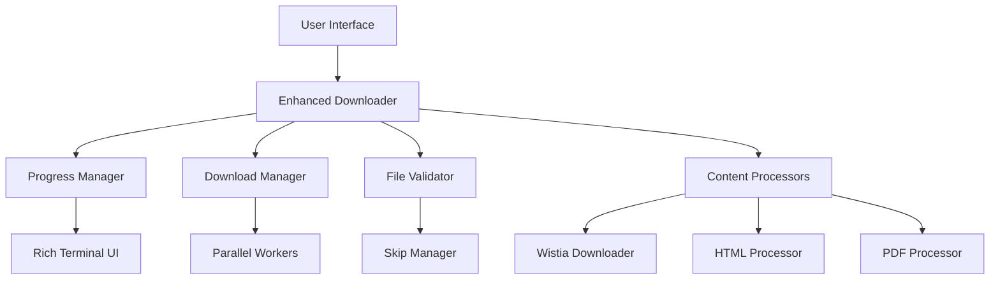
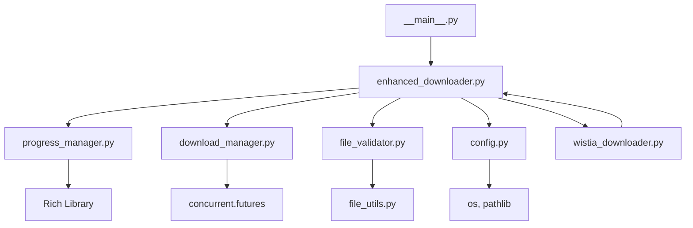

# 🛠️ Development Guide - Thinkific-Downloader

Welcome to the Thinkific-Downloader development guide! This document provides everything you need to contribute to, extend, or understand the codebase.

## 📋 Table of Contents

- [Architecture Overview](#architecture-overview)
- [Development Setup](#development-setup)
- [Code Structure](#code-structure)
- [Contributing Guidelines](#contributing-guidelines)
- [Testing](#testing)
- [Deployment](#deployment)
- [API Reference](#api-reference)
- [Advanced Topics](#advanced-topics)

---

## 🏗️ Architecture Overview

### **System Design**

The Thinkific-Downloader follows a modular, extensible architecture with clear separation of concerns:



### **Core Components**

#### **1. Enhanced Downloader** (`enhanced_downloader.py`)
- **Purpose**: Main orchestration and enhanced feature coordination
- **Responsibilities**:
  - Course initialization and processing
  - Download task queuing
  - Integration between all subsystems
  - Error handling and recovery

#### **2. Progress Manager** (`progress_manager.py`)
- **Purpose**: Rich terminal UI and progress tracking
- **Features**:
  - Real-time progress bars
  - Speed and ETA calculations
  - Thread-safe progress updates
  - Beautiful terminal output with Rich library

#### **3. Download Manager** (`download_manager.py`)
- **Purpose**: Parallel download orchestration
- **Features**:
  - Configurable thread pools
  - Rate limiting and bandwidth management
  - Retry logic with exponential backoff
  - Resource management


#### **4. Resume Tracker** (`resume_tracker.py`)
- **Purpose**: Atomic, cross-platform resume and status tracking
- **Features**:
    - Download status tracking and backup (Windows, Mac, Linux)
    - File integrity checking (size, checksums)
    - Resume detection and validation
    - Download metadata persistence
    - Smart skip decisions

#### **5. Content Processors**
- **Wistia Downloader** (`wistia_downloader.py`): Video processing
- **Enhanced Downloader**: HTML, PDF, Audio, Presentation processing
- **Modular design**: Easy to add new content types

---

## 💻 Development Setup

### **1. Environment Setup**

```bash
# Clone the repository
git clone https://github.com/itskavin/Thinkific-Downloader.git
cd Thinkific-Downloader

# Create virtual environment
python -m venv venv
source venv/bin/activate  # Linux/Mac
# or
venv\Scripts\activate     # Windows

# Install in development mode with dev dependencies
pip install -e ".[dev]"

# Or install manually
pip install -r requirements.txt
pip install -r requirements-dev.txt  # If exists
```

### **2. Development Tools Setup**

```bash
# Install additional development tools
pip install black isort flake8 mypy pytest pytest-cov

# Setup pre-commit hooks (if using pre-commit)
pip install pre-commit
pre-commit install
```

### **3. IDE Configuration**

#### **VS Code Settings** (`.vscode/settings.json`)
```json
{
    "python.defaultInterpreterPath": "./venv/bin/python",
    "python.linting.enabled": true,
    "python.linting.pylintEnabled": false,
    "python.linting.flake8Enabled": true,
    "python.formatting.provider": "black",
    "python.sortImports.args": ["--profile", "black"],
    "[python]": {
        "editor.formatOnSave": true,
        "editor.codeActionsOnSave": {
            "source.organizeImports": true
        }
    }
}
```

#### **PyCharm Configuration**
- Set Python interpreter to `./venv/bin/python`
- Enable Black formatting
- Configure isort with Black profile
- Enable type hints

---

## 📁 Code Structure

### **Project Layout**
```
thinkific_downloader/
├── __init__.py              # Package initialization
├── __main__.py              # Entry point with version switching
├── config.py                # Configuration management
├── downloader.py            # Legacy/basic downloader
├── enhanced_downloader.py   # Enhanced downloader with all features
├── progress_manager.py      # Rich UI and progress tracking
├── download_manager.py      # Parallel download orchestration
├── file_validator.py        # File validation and skip logic
├── file_utils.py            # File manipulation utilities
└── wistia_downloader.py     # Video-specific processing
```

### **Module Dependencies**


### **Data Flow**

1. **Initialization**: `__main__.py` → `enhanced_downloader.py`
2. **Configuration**: Load `.env` → `config.py` → `Settings`
3. **Course Processing**: API calls → Content parsing → Task creation
4. **Download Orchestration**: Task queue → `download_manager.py` → Parallel workers
5. **Progress Tracking**: Thread-safe updates → `progress_manager.py` → Rich UI
6. **Validation**: File checks → `resume_tracker.py` → Skip decisions

---

## 🤝 Contributing Guidelines

### **Code Style**

We follow strict code quality standards:

#### **Python Style**
- **Formatter**: Black (line length: 88)
- **Import sorting**: isort with Black profile
- **Linting**: flake8 with relaxed rules
- **Type hints**: Required for public APIs
- **Docstrings**: Google style for all public functions

#### **Example Code Style**
```python
"""
Module docstring with purpose and usage.

This module provides enhanced download capabilities with parallel processing
and intelligent retry logic.
"""

from typing import Dict, List, Optional
from pathlib import Path


class DownloadManager:
    """Manages parallel downloads with advanced features.
    
    Args:
        config: Download configuration settings
        progress_manager: Progress tracking instance
        
    Attributes:
        active_downloads: Currently running downloads
        completed_downloads: Successfully completed downloads
    """
    
    def __init__(self, config: DownloadConfig, progress_manager: ProgressManager):
        self.config = config
        self.progress_manager = progress_manager
        self.active_downloads: Dict[str, threading.Event] = {}
        
    def download_files(self, tasks: List[DownloadTask]) -> Dict[str, bool]:
        """Download multiple files in parallel.
        
        Args:
            tasks: List of download tasks to process
            
        Returns:
            Dictionary mapping file IDs to success status
            
        Raises:
            DownloadError: If critical download failure occurs
        """
        # Implementation here
        pass
```

### **Git Workflow**

#### **Branch Naming**
- **Features**: `feature/feature-name`
- **Bug fixes**: `fix/issue-description`
- **Documentation**: `docs/doc-update`
- **Refactoring**: `refactor/component-name`

#### **Commit Messages**
Follow conventional commits:
```
feat(progress): add real-time speed calculation
fix(download): handle connection timeout gracefully
docs(setup): update installation instructions
refactor(validator): improve file validation logic
```

#### **Pull Request Process**
1. Fork the repository
2. Create feature branch
3. Make changes with tests
4. Update documentation
5. Submit PR with clear description
6. Address review feedback
7. Ensure CI passes

### **Testing Requirements**

All new features must include:
- **Unit tests**: Test individual functions/methods
- **Integration tests**: Test component interactions
- **Documentation**: Update relevant docs
- **Examples**: Provide usage examples

---

## 🧪 Testing

### **Test Structure**
```
tests/
├── unit/
│   ├── test_progress_manager.py
│   ├── test_download_manager.py
│   ├── test_resume_tracker.py
│   └── test_enhanced_downloader.py
├── integration/
│   ├── test_full_download.py
│   └── test_resume_functionality.py
└── fixtures/
    ├── sample_course.json
    └── mock_responses/
```

### **Running Tests**
```bash
# Run all tests
pytest

# Run with coverage
pytest --cov=thinkific_downloader --cov-report=html

# Run specific test file
pytest tests/unit/test_progress_manager.py

# Run with verbose output
pytest -v

# Run only fast tests (skip slow integration tests)
pytest -m "not slow"
```

### **Writing Tests**

#### **Unit Test Example**
```python
import pytest
from unittest.mock import Mock, patch
from thinkific_downloader.progress_manager import ProgressManager


class TestProgressManager:
    @pytest.fixture
    def progress_manager(self):
        return ProgressManager()
        
    def test_add_download_creates_task(self, progress_manager):
        # Arrange
        file_id = "test_file"
        filename = "test.mp4"
        
        # Act
        download = progress_manager.add_download(file_id, filename, "http://test.com", Path("test.mp4"))
        
        # Assert
        assert file_id in progress_manager.downloads
        assert download.filename == filename

    def test_resume_tracker_atomic_save(self):
        from thinkific_downloader.resume_tracker import ResumeTracker
        import tempfile
        with tempfile.TemporaryDirectory() as tmpdir:
            status_file = Path(tmpdir) / ".download_status.json"
            tracker = ResumeTracker(str(status_file))
            tracker.status_data["test"] = {"status": "completed"}
            tracker._save_status()
            assert status_file.exists()
            backup_file = status_file.with_suffix('.json.bak')
            assert backup_file.exists()
        
    @patch('thinkific_downloader.progress_manager.time.time')
    def test_calculate_download_speed(self, mock_time, progress_manager):
        # Arrange
        mock_time.return_value = 100.0
        file_id = "test_file"
        
        # Act & Assert
        speed = progress_manager._calculate_speed(file_id, 1024, 101.0)
        assert speed == 1024.0  # 1024 bytes in 1 second
```

#### **Integration Test Example**
```python
import tempfile
import pytest
from pathlib import Path
from thinkific_downloader.enhanced_downloader import EnhancedDownloader


@pytest.mark.slow
class TestFullDownloadProcess:
    @pytest.fixture
    def temp_dir(self):
        with tempfile.TemporaryDirectory() as tmpdir:
            yield Path(tmpdir)
            
    def test_complete_download_workflow(self, temp_dir):
        # Arrange
        downloader = EnhancedDownloader()
        test_url = "http://httpbin.org/bytes/1024"
        file_path = temp_dir / "test_file.dat"
        
        # Act
        downloader.add_download_task("test", test_url, file_path)
        downloader.process_all_downloads()
        
        # Assert
        assert file_path.exists()
        assert file_path.stat().st_size == 1024
```

---

## 🚀 Deployment

### **Release Process**

#### **1. Version Bumping**
```bash
# Update version in setup.py and __init__.py
# Update CHANGELOG.md
# Commit version bump
git commit -m "chore: bump version to 2.0.0"
git tag v2.0.0
```

#### **2. Docker Release**
```bash
# Build multi-arch Docker image
docker buildx build --platform linux/amd64,linux/arm64 \
  -t kvnxo/thinkific-downloader:2.0.0 \
  -t kvnxo/thinkific-downloader:latest \
  --push .
```

#### **3. GitHub Release**
```bash
# Push tags
git push origin main --tags

# Create GitHub release with changelog
gh release create v2.0.0 --title "Version 2.0.0" --notes-file CHANGELOG.md
```

### **Continuous Integration**

#### **GitHub Actions Workflow** (`.github/workflows/ci.yml`)
```yaml
name: CI/CD Pipeline

on:
  push:
    branches: [ main ]
  pull_request:
    branches: [ main ]

jobs:
  test:
    runs-on: ubuntu-latest
    strategy:
      matrix:
        python-version: [3.8, 3.9, "3.10", "3.11"]
        
    steps:
    - uses: actions/checkout@v3
    
    - name: Set up Python ${{ matrix.python-version }}
      uses: actions/setup-python@v4
      with:
        python-version: ${{ matrix.python-version }}
        
    - name: Install dependencies
      run: |
        pip install -e ".[dev]"
        
    - name: Run tests
      run: |
        pytest --cov=thinkific_downloader --cov-report=xml
        
    - name: Upload coverage
      uses: codecov/codecov-action@v3
      
  build-docker:
    needs: test
    runs-on: ubuntu-latest
    if: github.ref == 'refs/heads/main'
    
    steps:
    - uses: actions/checkout@v3
    
    - name: Build and push Docker image
      uses: docker/build-push-action@v4
      with:
        push: true
        tags: kvnxo/thinkific-downloader:latest
```

---

## 📚 API Reference

### **Core Classes**

#### **EnhancedDownloader**
```python
class EnhancedDownloader:
    """Main enhanced downloader with all advanced features."""
    
    def initialize_systems(self) -> None:
        """Initialize download systems with user settings."""
        
    def add_download_task(
        self, 
        file_id: str, 
        url: str, 
        file_path: Path,
        expected_size: Optional[int] = None,
        priority: int = 0
    ) -> None:
        """Add a download task to the queue."""
        
    def process_all_downloads(self) -> None:
        """Process all queued downloads with parallel processing."""
```

#### **ProgressManager**
```python
class ProgressManager:
    """Thread-safe progress manager with rich terminal UI."""
    
    def start_monitoring(self) -> None:
        """Start the live monitoring display."""
        
    def add_download(
        self,
        file_id: str,
        filename: str,
        url: str,
        file_path: Path,
        total_size: Optional[int] = None
    ) -> FileDownload:
        """Add a new download task."""
        
    def update_download_progress(
        self, 
        file_id: str, 
        downloaded: int,
        speed: Optional[float] = None
    ) -> None:
        """Update download progress for a specific file."""
```

#### **DownloadManager**
```python
class DownloadManager:
    """Thread-safe parallel download manager."""
    
    def download_files(
        self, 
        tasks: List[DownloadTask],
        on_complete: Optional[Callable] = None
    ) -> Dict[str, bool]:
        """Download multiple files in parallel."""
        
    def cancel_all_downloads(self) -> None:
        """Cancel all active downloads."""
```

### **Configuration**

#### **Settings Class**
```python
@dataclass
class Settings:
    # Required authentication
    client_date: str
    cookie_data: str
    
    # Basic settings
    video_download_quality: str = '720p'
    
    # Enhanced features
    concurrent_downloads: int = 3
    retry_attempts: int = 3
    rate_limit_mb_s: Optional[float] = None
    validate_downloads: bool = True
    resume_partial: bool = True
    debug: bool = False
```

### **Data Structures**

#### **DownloadTask**
```python
@dataclass
class DownloadTask:
    file_id: str
    url: str
    file_path: Path
    headers: Optional[Dict[str, str]] = None
    expected_size: Optional[int] = None
    priority: int = 0
```

#### **FileDownload**
```python
@dataclass
class FileDownload:
    file_id: str
    filename: str
    url: str
    file_path: Path
    total_size: Optional[int] = None
    downloaded_size: int = 0
    status: DownloadStatus = DownloadStatus.QUEUED
```

---

## 🔬 Advanced Topics

### **Adding New Content Types**

To add support for a new content type:

1. **Create processor function**:
```python
def process_new_content_type(match: Dict[str, Any], index: int, 
                           chapter_name: str, lesson_name: str):
    """Process new content type."""
    # Implementation
    pass
```

2. **Add to content dispatcher** in `chapterwise_download()`:
```python
elif ctype == 'NewContentType':
    process_new_content_type(match, index, chapter_name, lesson_name)
```

3. **Add tests**:
```python
def test_process_new_content_type():
    # Test implementation
    pass
```

### **Custom Progress Handlers**

Create custom progress display:

```python
class CustomProgressHandler:
    def __init__(self):
        self.progress_data = {}
        
    def on_download_start(self, file_id: str, filename: str):
        # Custom start logic
        pass
        
    def on_progress_update(self, file_id: str, progress: float):
        # Custom progress logic
        pass
        
    def on_download_complete(self, file_id: str, success: bool):
        # Custom completion logic
        pass

# Usage
progress_manager.add_custom_handler(CustomProgressHandler())
```

### **Plugin System (Future)**

Framework for extensible plugins:

```python
class DownloaderPlugin:
    """Base class for downloader plugins."""
    
    def should_handle(self, content_type: str) -> bool:
        """Return True if this plugin handles the content type."""
        raise NotImplementedError
        
    def process_content(self, content_data: Dict[str, Any]) -> List[DownloadTask]:
        """Process content and return download tasks."""
        raise NotImplementedError

# Example plugin
class YouTubePlugin(DownloaderPlugin):
    def should_handle(self, content_type: str) -> bool:
        return content_type == 'YouTubeEmbed'
        
    def process_content(self, content_data: Dict[str, Any]) -> List[DownloadTask]:
        # YouTube-specific processing
        pass
```

### **Performance Optimization**

#### **Memory Usage**
- Use generators for large datasets
- Implement streaming for large files
- Clear completed tasks from memory

#### **Network Optimization**
- Connection pooling
- HTTP/2 support
- Adaptive retry strategies

#### **Disk I/O Optimization**
- Asynchronous file operations
- Batch file system operations
- Temporary file management

---

## 🔍 Debugging

### **Debug Mode**
Enable comprehensive debugging:
```env
DEBUG=true
LOG_LEVEL=DEBUG
```

### **Logging Configuration**
```python
import logging

# Configure detailed logging
logging.basicConfig(
    level=logging.DEBUG,
    format='%(asctime)s - %(name)s - %(levelname)s - %(message)s',
    handlers=[
        logging.FileHandler('debug.log'),
        logging.StreamHandler()
    ]
)
```

### **Common Debug Scenarios**

#### **Download Failures**
```python
# Add debug logging to download manager
logger.debug(f"Starting download: {task.url}")
logger.debug(f"Headers: {task.headers}")
logger.debug(f"Expected size: {task.expected_size}")
```

#### **Progress Issues**
```python
# Monitor progress updates
logger.debug(f"Progress update: {file_id} - {downloaded}/{total}")
logger.debug(f"Speed: {speed} bytes/sec")
```

#### **File Validation Problems**
```python
# Detailed validation logging
logger.debug(f"Validating file: {file_path}")
logger.debug(f"Expected size: {expected_size}, Actual: {actual_size}")
logger.debug(f"Checksum: {calculated_checksum}")
```

---

## 📖 Resources

### **Documentation**
- [Python Type Hints](https://docs.python.org/3/library/typing.html)
- [Rich Library](https://rich.readthedocs.io/)
- [Docker Best Practices](https://docs.docker.com/develop/dev-best-practices/)
- [pytest Documentation](https://docs.pytest.org/)

### **Tools**
- [Black Formatter](https://black.readthedocs.io/)
- [isort Import Sorter](https://pycqa.github.io/isort/)
- [mypy Type Checker](https://mypy.readthedocs.io/)
- [pre-commit Hooks](https://pre-commit.com/)

### **Community**
- **GitHub Issues**: Bug reports and feature requests
- **GitHub Discussions**: General questions and ideas
- **Code Reviews**: Learn from other contributors

---

**Ready to contribute?** Start with a good first issue, join our discussions, and help make Thinkific-Downloader even better! 🚀