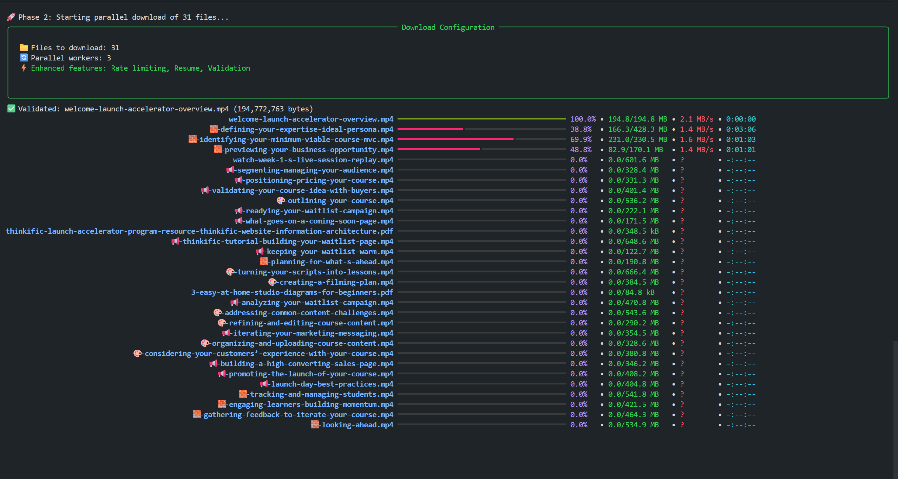

# 📥 Thinkific-Downloader

[](https://www.python.org/downloads/)
[](LICENSE)
[](https://hub.docker.com/r/kvnxo/thinkific-downloader)
[](https://packaging.python.org/en/latest/)
[](https://rich.readthedocs.io/)

A modern, feature-rich Python utility to download courses from Thinkific platforms for personal offline learning with **advanced parallel processing**, **intelligent progress monitoring**, and **smart file validation**.

## ⚠️ **Disclaimer**

> **"With great power comes great responsibility."** - This tool is designed to help learners access their purchased educational content offline. Please use it ethically and responsibly.

**This tool is for personal educational use only.** Please respect copyright laws and terms of service:

- ✅ **Use for personal offline learning**
- ✅ **Support course creators by purchasing courses legally**
- ❌ **Do NOT redistribute downloaded content**  
- ❌ **Do NOT use for commercial purposes**
- ❌ **Do NOT violate course platform terms of service**

**The developer is not responsible for any misuse of this tool.** Users are solely responsible for ensuring their usage complies with applicable laws and terms of service.

## ✨ **New Enhanced Features**

### 🚀 **Advanced Performance**
- **🔄 Parallel Processing** - Download multiple files simultaneously (configurable 1-10 threads)
- **📊 Rich Progress Monitoring** - Beautiful terminal UI with real-time progress, speed, and ETA
- **🧠 Smart File Validation** - Automatic integrity checking and corruption detection
- **▶️ Resume Downloads** - Intelligent partial download recovery and continuation
- **⏭️ Skip Existing Files** - Automatic detection and skipping of completed downloads
- **💾 Atomic Resume/Backup System** - Cross-platform safe status tracking and backup (Windows, Mac, Linux)

### 🎯 **Progress Monitoring**
#### Example Progress UI



### 🔒 **Reliability & Safety**
- **🔄 Exponential Retry Logic** - Smart retry with jitter for failed downloads
- **🚦 Rate Limiting** - Configurable bandwidth limiting to respect servers
- **🔍 File Integrity Checks** - SHA256 checksums and size validation
- **💾 Download Metadata** - Persistent state tracking for resume capability

### **🎯 Content Type Support**

| Content Type | Status | Processing Engine | Features |
|-------------|--------|------------------|----------|
| 🎥 **Videos (Wistia)** | ✅ Full | `wistia_downloader.py` | Multi-quality, chunks, resume |
| 🎥 **Videos (Other)** | ✅ Full | `downloader.py` | Direct download, progress tracking |
| 📄 **HTML Content** | ✅ Full | `downloader.py` | Clean extraction, formatting |
| 📚 **PDF Documents** | ✅ Full | `downloader.py` | Direct download, validation |
| 🎵 **Audio Files** | ✅ Full | `downloader.py` | MP3, M4A support |
| 🎯 **Quizzes** | ✅ Basic | `downloader.py` | Structure extraction |
| 🎨 **Presentations** | ✅ Full | FFmpeg merge | Multi-slide processing |

## ✨ **Features**

### 🚀 **Performance & Reliability**
- **Modern Python Architecture** - Clean, maintainable package structure
- **Async/Sync Hybrid** - Optimal performance for different content types  
- **Smart Progress Tracking** - Rich terminal UI with real-time progress
- **Intelligent Retry Logic** - Exponential backoff with jitter
- **Memory Efficient** - Chunked downloads for large files

### 📊 **User Experience**
- **Rich Terminal Interface** - Beautiful progress bars and status updates
- **Smart File Organization** - Logical folder structure with clean naming
- **Resume Support** - Skip existing files, continue interrupted downloads
- **Atomic Resume/Backup** - Status file is always safely backed up and updated, works on Windows, Mac, Linux
- **Multiple Quality Options** - Choose video quality (720p, 1080p, etc.)
- **Comprehensive Logging** - Debug mode for troubleshooting

### 🛡️ **Safety & Compliance**
- **Rate Limiting** - Respectful downloading to avoid detection
- **Session Management** - Proper authentication handling
- **Error Recovery** - Graceful handling of network issues
- **Validation** - File integrity checks and cleanup
- **Atomic Status File** - Download status is always saved safely, with backup, for reliable resume

## 🎯 **Quick Start**

### **🐳 Docker (Recommended)**

```bash
docker pull kvnxo/thinkific-downloader
docker run -it --rm -v $(pwd)/downloads:/app/downloads kvnxo/thinkific-downloader
```

### **🐍 Python Direct**

```bash
git clone https://github.com/itskavin/Thinkific-Downloader.git
cd Thinkific-Downloader
pip install -r requirements.txt

# Update environment variables in .env or export them directly
python thinkidownloader3.py

```

> **Resume/Backup System:**
> - Download status is tracked in `.download_status.json` (atomic, cross-platform)
> - A backup `.download_status.json.bak` is created automatically before each update
> - If interrupted, simply rerun the downloader to resume from where you left off
> - Works seamlessly on Windows, Mac, and Linux

> 📖 **Need detailed setup instructions?** Check out our comprehensive [**SETUP.md**](SETUP.md) guide for step-by-step installation, troubleshooting, and configuration options.

> 👨‍💻 **Developer?** Visit [**DEVELOPMENT.md**](DEVELOPMENT.md) for architecture overview, API reference, and contribution guidelines.

## ⚙️ **Enhanced Configuration**

Configure advanced features via environment variables or `.env` file:

```bash
# Required
COURSE_LINK=""              # Thinkific course URL
COOKIE_DATA=""              # Browser cookies for authentication
CLIENT_DATE=""              # Client date header

# Optional - Performance
VIDEO_DOWNLOAD_QUALITY="Original File" # Video quality (Original File,720p, 1080p, etc.)
CONCURRENT_DOWNLOADS=3       # Number of parallel downloads (1-10 recommended)
RETRY_ATTEMPTS=3            # Number of retry attempts for failed downloads
RATE_LIMIT_MB_S=0           # Rate limit in MB/s (0 = unlimited)
DOWNLOAD_DELAY=1.0          # Delay between downloads (seconds)

# Optional - Features
VALIDATE_DOWNLOADS=true     # Enable file integrity validation
RESUME_PARTIAL=true         # Enable resume for partial downloads
DEBUG=false                 # Enable debug logging

# Optional - System
OUTPUT_DIR=./downloads      # Download directory
FFMPEG_PRESENTATION_MERGE=false # Enable FFmpeg presentation merging
LOG_LEVEL=INFO              # Logging level (DEBUG, INFO, WARNING)
```
```

### **⚡ Quick Start Commands**

```bash
# Run as package
python -m thinkific_downloader

# Run as script  
python thinkidownloader3.py

# With environment file
python -m thinkific_downloader --config .env

# Docker compose
docker-compose up
```


## 📁 **Output Structure**

```
📁 Course Name/
├── 📁 01. Introduction/
│   ├── 📁 01. Welcome Video/
│   │   ├── 🎥 welcome-video.mp4
│   │   └── 📄 video-info.json
│   └── 📁 02. Course Overview/
│       ├── 📄 course-overview.html
│       └── 📊 quiz-structure.json
├── 📁 02. Getting Started/
│   └── 📁 01. Setup Instructions/
│       ├── 🎥 setup-instructions.mp4
│       ├── 📄 setup-guide.pdf
│       └── 🎨 presentation-slides.mp4
├── 📄 course-metadata.json
└── 📊 download-summary.json
```


### **Supported Content Types**

| Type | Extensions | Processing | Notes |
|------|-----------|------------|-------|
| **Videos** | `.mp4`, `.webm`, `.mov` | Wistia + Direct | Quality selection, resume support |
| **Audio** | `.mp3`, `.m4a`, `.ogg` | Direct download | Metadata preservation |
| **Documents** | `.pdf`, `.docx` | Direct download | Validation checks |
| **Web Content** | `.html` | Content extraction | Clean formatting |
| **Presentations** | Multi-slide | FFmpeg merge | Combined video output |
| **Quizzes** | `.json` | Structure export | Question/answer format |

## ❓ **FAQ**
### **Resume/Backup System**

**Q: How does resume work?**
- The downloader automatically tracks download status in `.download_status.json`.
- Before updating, a backup `.download_status.json.bak` is created (atomic, safe).
- If interrupted, just rerun the downloader. It will resume partial downloads, skip completed files, and retry failed ones.
- No manual intervention needed.

**Q: Is it safe on Windows, Mac, Linux?**
- Yes! The resume/backup system uses atomic file operations and works on all major platforms.

**Q: Where is the status file stored?**
- In the current working directory (where you run the downloader).

**Q: Can I delete the status file?**
- Yes, but you will lose resume progress. The backup file is for safety only.
### **🔐 Authentication & Setup**

**Q: How do I get the required authentication data?**
1. Open your course in a browser and log in
2. Open Developer Tools (F12)
3. Go to Network tab and refresh the page
4. **Search for requests containing `course_player/v2/courses/`**
5. **Click on the matched request** (there should be one)
6. **Click on "Raw" tab** for easier copying
7. **First, adjust the `COURSE_LINK` in your `.env` file** to match the course URL
8. **Look for "set-cookie" and copy the value into `COOKIE_DATA`**
9. **Copy the "date" value into `CLIENT_DATE`**

**Q: How often do I need to update authentication?**
- Authentication typically expires after 24-48 hours
- You'll get authentication errors when it expires
- Simply update the `.env` file with fresh values

### **🚀 Performance & Downloads**

**Q: Will I get banned for using this?**
The tool includes safety features, but follow best practices:
- Use conservative settings (max 2-3 concurrent downloads)
- Add delays between downloads (1-2 seconds)
- Don't run multiple instances simultaneously  
- Take breaks between large downloads

**Q: What if downloads fail?**
- The tool has automatic retry with exponential backoff
- Use resume functionality - restart to skip completed files
- Check logs with `LOG_LEVEL=DEBUG` for detailed troubleshooting
- Verify authentication hasn't expired

**Q: Can I download specific content types only?**
Currently downloads entire courses, but you can:
- Stop the process and keep what's downloaded
- Use file filters in your download directory
- Future versions may include selective downloading

### **🐳 Docker & Deployment**

**Q: Why use Docker?**
- ✅ **FFmpeg included** - No manual installation
- ✅ **Consistent environment** - Works everywhere
- ✅ **Easy updates** - `docker pull` for latest version
- ✅ **Isolated** - Doesn't affect your system

**Q: How do I update the Docker image?**
```bash
docker pull kvnxo/thinkific-downloader:latest
docker-compose up --force-recreate
```

### **🔧 Technical Issues**

**Q: FFmpeg not found error?**
- **Docker**: FFmpeg is pre-installed
- **Python**: Install with `sudo apt-get install ffmpeg` (Linux) or `brew install ffmpeg` (Mac)
- **Windows**: Download from https://ffmpeg.org/download.html

**Q: Memory issues with large files?**
- The tool uses chunked downloading to minimize memory usage
- For very large files, ensure you have enough disk space
- Consider using `CONCURRENT_DOWNLOADS=1` for memory-constrained systems

## 🛠️ **Development & Contributing**

> 👨‍💻 **For developers:** See [**DEVELOPMENT.md**](DEVELOPMENT.md) for complete development setup, architecture overview, API reference, testing guidelines, and contribution workflow.

### **Quick Contributing**
- 🍴 Fork the repository
- 🌿 Create a feature branch  
- ✅ Add tests for new features
- 📝 Update documentation
- 🚀 Submit a pull request

## 💬 **Support & Community**

### **🆘 Getting Help**
- 📖 **Documentation**: [SETUP.md](SETUP.md) and [DEVELOPMENT.md](DEVELOPMENT.md)
- 🐛 **Bug Reports**: [GitHub Issues](https://github.com/itskavin/Thinkific-Downloader/issues)
- 💡 **Feature Requests**: [GitHub Discussions](https://github.com/itskavin/Thinkific-Downloader/discussions)
- 🗨️ **Community**: Join discussions and share tips

### **🐞 Before Reporting Issues**
1. ✅ Check existing issues for duplicates
2. ✅ Include your operating system and Python version
3. ✅ Provide relevant log output (use `LOG_LEVEL=DEBUG`)
4. ✅ Describe steps to reproduce the problem
5. ✅ Include the error message or unexpected behavior

### **🏷️ Issue Template**
```
**Environment:**
- OS: Windows 11 / macOS 13 / Ubuntu 22.04
- Python: 3.11.2
- Docker: 24.0.6 (if applicable)

**Error:**
[Paste error message or describe issue]

**Steps to reproduce:**
1. Set environment variables...
2. Run command...
3. Error occurs at...

**Expected behavior:**
[What you expected to happen]

**Logs:**
[Paste relevant log output with LOG_LEVEL=DEBUG]
```

## 🌟 **Show Your Support**

### **⭐ Star the Repository**
If this tool helps you with your learning journey, please star the repository!

### **🤝 Contribute**
- 🍴 **Fork** and improve the code
- 📝 **Documentation** improvements
- 🧪 **Testing** on different platforms
- 🎨 **UI/UX** enhancements

### **💝 Support Education**
- 🎓 **Support course creators** by purchasing their content legally
- 🤝 **Share responsibly** with fellow learners
- 🎓 **Use for learning** - respect intellectual property
- 🤝 **Give back** to the open-source community

## 🤖 **Legal & Ethics**

### **📜 Terms of Use**
This tool is provided for educational purposes only. By using this software:

1. ✅ **You agree** to use it only for courses you have legally purchased
2. ✅ **You agree** to respect copyright laws and platform terms of service  
3. ✅ **You agree** not to redistribute downloaded content
4. ✅ **You understand** the risks and take full responsibility

### **⚖️ Disclaimer**
- The developers are not responsible for any misuse of this tool
- Users are solely responsible for compliance with applicable laws
- This tool is provided "as-is" without warranty of any kind
- Course platforms may update their systems, breaking compatibility

## 📜 **License**

This project is licensed under the MIT License - see the [LICENSE](LICENSE) file for details.

### **📋 License Summary**
- ✅ **Commercial use** allowed
- ✅ **Modification** allowed  
- ✅ **Distribution** allowed
- ✅ **Private use** allowed
- ❌ **Liability** - No warranty provided
- ❌ **Warranty** - Use at your own risk

---

## 🎓 **Final Words**

> **"Education is the most powerful weapon which you can use to change the world."** - Nelson Mandela
> 
> This tool exists to help learners access their purchased educational content offline. Use it responsibly, support course creators, and never stop learning.

**Happy Learning!** 🚀 **Remember to support course creators by purchasing their content legally!**

---

### **🔗 Quick Links**
- 🏠 **Homepage**: [GitHub Repository](https://github.com/itskavin/Thinkific-Downloader)
- 📦 **Docker Hub**: [kvnxo/thinkific-downloader](https://hub.docker.com/r/kvnxo/thinkific-downloader)
- 🐛 **Issues**: [Report Bugs](https://github.com/itskavin/Thinkific-Downloader/issues)
- 💬 **Discussions**: [Community](https://github.com/itskavin/Thinkific-Downloader/discussions)
- 📜 **License**: [MIT License](LICENSE)
